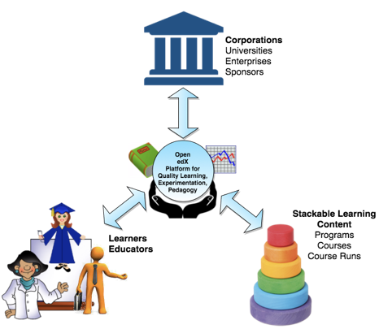
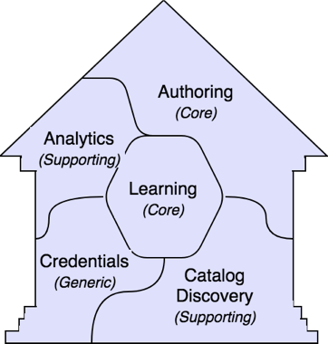
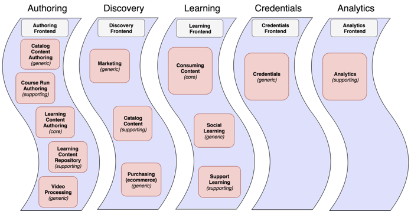
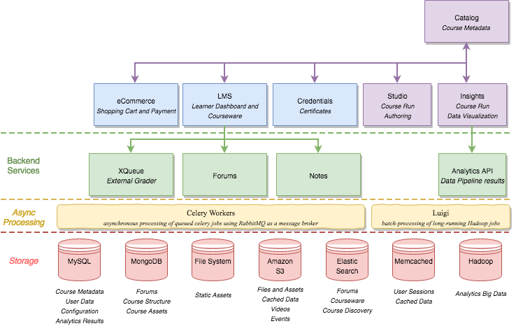
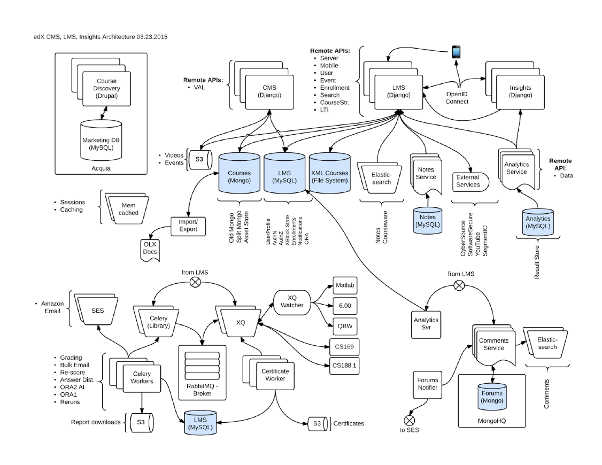
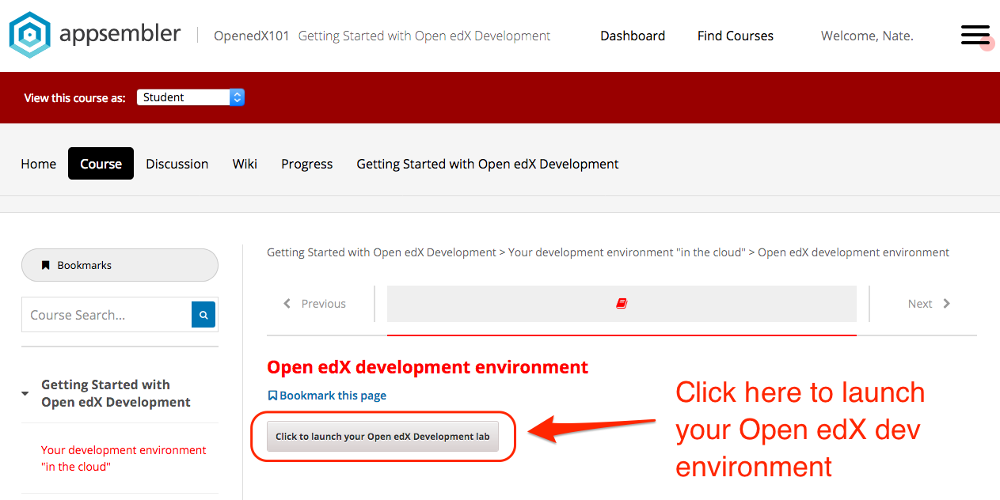

<!-- uncomment this commented section if you're using Madoko to edit the markdown
[INCLUDE=presentation]
Title         : Getting Started with Open edX Development
Sub Title     : Open edX Conference 2018
Author        : Nate Aune
Affiliation   : Appsembler
Email         : nate@appsembler.com
Reveal Theme  : sky
Beamer Theme  : singapore
-->

<!-- these slides were crafted using the approach outlined in this blog post: 
http://www.markusz.io/posts/2018/03/16/revealjs-docker-markdown-slides/

Using the embedding external Markdown feature of Reveal.js
https://github.com/appsembler/2018-openedx-developer-workshop#external-markdown

To render these slides as navigable HTML:

$ npm install
$ npm start   (<-- this will launch a browser and connect to localhost)

If you want a printable PDF, go to http://localhost:8000?print-pdf
-->

## Getting Started with Open edX Development
### Open edX Conference 2018
### Montreal, Canada
### May 29, 2018


## Housekeeping

Follow along with these slides at:
https://appsembler.github.io/2018-openedx-developer-workshop/

Make yourself a PDF version:
https://appsembler.github.io/2018-openedx-developer-workshop?print-pdf

Please write your name/email on the sheet that's going around.


## Introductions

Your esteemed workshop facilitators! 

- Nate Aune (nate@appsembler.com)
- Omar Al-Ithawi (omar@appsembler.com)
- Nimisha Asthagiri (nasthagiri@edx.org)
- Feanil Patel (feanil@edx.org)


## Who are you?

Welcome! Share a few words about yourself...

- Your name
- Your affiliation 
- Your level of experience with Open edX


## Agenda

* Why develop Open edX?
* What do I need to know?
* How do I do it? (hands-on exercises)
* Where can I go for help?
* Questions?


## WHY?

Why might you want to do development on Open edX?

 <!-- .element height="25%" width="25%" style="border: 0; background: None; box-shadow: None" -->


## Some reasons... 

What are some other reasons that you might want to learn about Open edX?


## Curious how it works

Example of a scalable Django app serving millions of users.


## Customize your own instance

One of the benefits of Open Source software is that you can customize the software to meet your specific needs.

You can create a branded site with your own theme using your own domain name.


## What do I need to know?

* Key skills and competencies
* Technologies used by Open edX
* Open edX system architecture


## Key skills and competencies

* Full-stack web development (Python/Django/JS)
* DevOps experience (Linux, Cloud hosting)
* Open source experience helps


## Technologies

Technologies that Open edX uses:

* Django (web development framework)
* Python (scripting language)
* ReactJS/BackboneJS (frontend javascript)
* MySQL (DB where student data is stored)
* MongoDB (DB where course data is stored)
* RabbitMQ (process background tasks)
* Ansible (configuration management)
* Hadoop (distributed processing)


## Stackable learning content




## Themes




## Themes explained




## edX architecture #1

 <!-- .element height="80%" width="80%" -->


## edX architecture #2


## edX architecture #3

 <!-- .element height="70%" width="70%" -->


## Exercises for today

* Start/stop the LMS and CMS (Studio)
* Create a superuser
* Change the platform name
* Make a small change to a custom theme
* Install and enable a 3rd party XBlock


## What we're not going to cover

* Deploy an Open edX site to production
* Build a custom theme from scratch
* Create an XBlock from scratch
* Discuss every feature Open edX provides
* Localization and translations


## Questions?

Who's ready to get started!?


## Get your development environment

 <!-- .element height="70%" width="70%" -->


## Open edX dev "in the cloud"

Go to http://8888-xxxxx.demo-wharf.appsembler.com/entry.html

Where `xxxxx` identifies your personal development environment.
(Every student will have their own unique URL)

[screenshot of the development environment]


## Start the LMS

```shell
$ cd /openedx/edx-platform
$ supervisorctl start lms
```

You should now be able to go to the URL that was provided before, to see the LMS running.

Find log files here: `/var/log/supervisor/lms-stderr.log` and `lms-stdout.log`

## Start the CMS (Studio)

```shell
$ cd /openedx/edx-platform
$ supervisorctl start cms
```

You should now be able to go to the URL that was provided before, to see Studio running.

Find log files here: `/var/log/supervisor/cms-stderr.log` and `cms-stdout.log`


## Another way to start/stop services

```shell
$ cd /openedx/edx-platform
$ ./manage.py lms runserver 0.0.0.0:8000
$ ./manage.py cms runserver 0.0.0.0:8001
```

Both of these commands run in the foreground, which is why we use supervisor to run them in the background.


## Create a superuser

```shell
$ cd /openedx/edx-platform
$ ./manage.py lms createsuperuser
...
Username (leave blank to use 'root'): staff
Email address: staff@example.com
Password:
Password (again):
Superuser created successfully.
$
```


## Django settings

The Django settings files inherit from `common.py` and the `*.json` files overwrite these settings.

 <!-- .element height="50%" width="50%" -->


## Change platform name

Edit the `lms.env.json` file and change this line:

```json
  "PLATFORM_NAME": "Open edX 2018 demo",
```

To:

```json
  "PLATFORM_NAME": "Poutine in Montreal",
```

Now restart the LMS to see your change.


## Intro to themes

Rather than using the default theme, you might want to try one of the other themes that ship with Open edX. You can find these in the `/themes` directory.

```shell
$ cd /openedx/edx-platform/themes
$ ls
README.rst  conf  edge.edx.org  edx.org  red-theme  stanford-style
```


## Activate red-theme

Edit the `lms.env.json` file and add the following lines:

```json
{
...
  "ENABLE_COMPREHENSIVE_THEMING": true,
  "COMPREHENSIVE_THEME_DIRS": ["/openedx/edx-platform/themes"],
  "DEFAULT_SITE_THEME": "red-theme",
...
}
```


## Update assets

If you restart the LMS and look at the site, it won't look quite right.

That's because we still need to compile the theme assets with this command:

```shell
$ paver update_assets lms --settings=universal.development
...
Finished collecting lms assets.
```


## Install a new theme

Maybe you don't like red, and you'd prefer blue.

Let's install the `blue-theme`!

```shell
$ cd /openedx/edx-platform/themes
$ git clone https://github.com/appsembler/blue-theme
```

Edit the `lms.env.json` file and change this line:

```json
{
...
  "DEFAULT_SITE_THEME": "blue-theme",
...
}
```


## Make some customizations

Let's replace the logo with our own.

```shell
$ cd /openedx/edx-platform/themes/blue-theme/lms/static/images
$ curl -LO http://bit.ly/appsembler-logo
$ mv appsembler-logo appsembler-logo.svg
```


## Change the header template

In the code editor, navigate to the file `/openedx/edx-platform/themes/blue-theme/lms/templates/header.html`

Find this block:

```html
<%block name="navigation_logo">
  
</%block>
```

And replace `images/logo.png` with `images/appsembler-logo.svg`


## XBlocks

What is an XBlock?


## Where do I find these XBlocks?

* [XBlocks Directory in edX wiki](https://openedx.atlassian.net/wiki/display/COMM/XBlocks+Directory)
* [Search Github for "xblock" - 499 at last count!](https://github.com/search?q=xblock&type=Repositories)


## Let's install an XBlock!

There's a cool video in-video quiz XBlock from Stanford.

```
$ pip install -e git+https://github.com/Stanford-Online/xblock-in-video-quiz.git#egg=xblock-in-video-quiz
...
Successfully installed invideoquiz-xblock
$ paver update_assets lms --settings=universal.development
$ paver update_assets cms --settings=universal.development
```

The URL is: https://github.com/Stanford-Online/xblock-in-video-quiz.git

Now we can go into Studio to activate this XBlock for our course.


## Where to go for help

* Documentation
	* Official docs
	* Confluence wiki
	* Slides and videos

* Community
	* Mailing list
	* Slack community
	* Stackoverflow

* Tutorials / Workshops


## Documentation

* [Official docs.edx.org](https://docs.edx.org)
* [Building and Running Open edX](https://edx.readthedocs.io/projects/open-edx-building-and-running-a-course/en/open-release-ginkgo.master/)
* [Installing, Configuring and Running Open edX](https://edx.readthedocs.io/projects/edx-installing-configuring-and-running/en/open-release-ginkgo.master/)
* [Open edX Developer Guide](https://edx.readthedocs.io/projects/edx-developer-guide/en/latest/)
* [edX's Confluence Wiki](http://openedx.atlassian.net/wiki)
* [Open edX Youtube Channel](http://youtube.com/c/openedx)
* [edX Architecture Onboarding](https://docs.google.com/presentation/d/1X3QaSw4sqPLvkXBhC8phoFA7j8dhsL08MCZWwIDMIBE/)


## Community

* [edx-code Mailing list](http://groups.google.com/group/edx-code)
* [Slack community](https://openedx.slack.com/)
* [Stackoverflow](https://stackoverflow.com/questions/tagged/openedx)
* [edXchange](https://edxchange.opencraft.com)


## Tutorials @ 10:40am

* [Open edX from Scratch](https://openedx2018.sched.com/event/EUAN/open-edx-from-scratch)
* [Maintainable Open edX Extensions](https://openedx2018.sched.com/event/EUAW/maintainable-open-edx-extensions)
* [Studio frontend](https://openedx2018.sched.com/event/EUAR/studio-frontend-develop-on-the-edx-platform-using-modern-frontend-technology)


## Tutorials @ 1:20pm

* [Deployment for Small Institutions](https://openedx2018.sched.com/event/EUAO/deployment-for-small-institutions)


## Tutorials @ 3:00pm

* [Running Open edX in production with Docker](https://openedx2018.sched.com/event/EUAP/running-open-edx-in-production-with-docker)
* [iOS & Android Application InstallFest](https://openedx2018.sched.com/event/EUAT/ios-android-application-installfest)
* [Open edX 101 - Basic course authoring](https://openedx2018.sched.com/event/EUAL/open-edx-101-basic-course-authoring)


# Thank you!

Please share your feedback with this quick survey
[insert survey link]

Contact me with any questions: nate@appsembler.com


## Credits

* Nimisha for her help with the workshop and sharing her awesome slides
* Feanil for being here and making a great presentation about hosting edX
* Omar for being here and creating the blue-theme
* Filip for putting together the dev environment. Huge timesaver!
* Lawrence McDaniel for his How to install an XBlock tutorial
